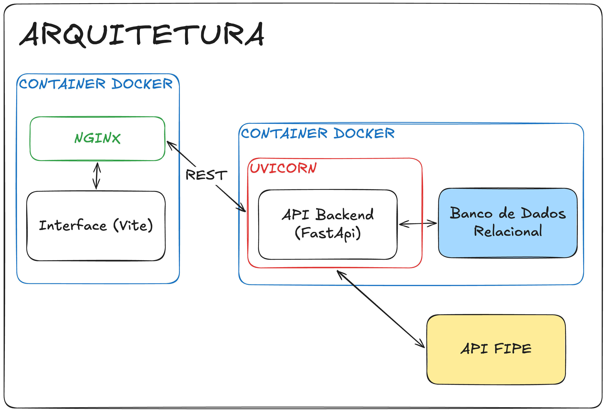

# Garage FIPE Frontend

Aplicação web em React + TypeScript para consulta de veículos na tabela FIPE, autenticação de usuários e gerenciamento da garagem pessoal (salvar, listar e remover veículos).

## Tecnologias

- React 19
- TypeScript
- Vite
- Tailwind CSS
- Axios
- ESLint

## Pré-requisitos

Antes de iniciar, tenha instalado na sua máquina:

- Node.js 18 ou superior
- npm (normalmente já vem com o Node)

## Instalação e configuração local

1. Entre na pasta do frontend:

	cd garage-frontend

2. Instale as dependências:

	npm install

3. Garanta que a API backend esteja em execução em:

	http://localhost:8000

	Observação:
	o frontend está configurado para consumir esse endereço em src/configs/axiosApi.tsx.

4. Inicie o ambiente de desenvolvimento:

	npm run dev

5. Abra no navegador o endereço exibido no terminal (geralmente):

	http://localhost:5173

## Executando com Docker Compose

O arquivo [garage-frontend/docker-compose.yml](garage-frontend/docker-compose.yml) sobe o frontend e a API backend juntos.

1. Entre na pasta do frontend:

	cd garage-frontend

2. Suba os serviços:

	docker compose up --build

3. Acesse as aplicações:

	Frontend: http://localhost:8080

	Backend: http://localhost:8000

	Swagger da API: http://localhost:8000/docs

4. Para parar os containers:

	docker compose down

Observações:

- O serviço `mvp-api-principal` monta a pasta `../mvp-api-principal/database` em `/app/database`.
- Isso reutiliza o arquivo `database.db` já existente para persistência dos dados.

## Scripts disponíveis

- npm run dev: inicia o servidor de desenvolvimento com hot reload.
- npm run build: gera o build de produção.
- npm run preview: executa localmente o build de produção.
- npm run lint: executa verificação de lint no projeto.

## Estrutura principal

- src/components: componentes visuais e de fluxo (login, busca, garagem, cards etc.).
- src/context: contexto global de usuário e autenticação.
- src/configs: configuração de cliente HTTP (Axios).
- src/helpers: funções utilitárias.

## Fluxo básico de uso

1. O usuário pode criar conta ou fazer login.
2. Após autenticado, pode buscar veículos por tipo, marca, modelo e ano.
3. O veículo selecionado pode ser salvo na garagem.
4. A garagem lista os veículos salvos e permite removê-los.

## API Externa Utilizada

Este projeto utiliza a API pública da Tabela FIPE disponibilizada em:

https://deividfortuna.github.io/fipe/v2/

Ela é usada para consultar dados de marcas, modelos, anos e valores de veículos, que depois são exibidos no frontend e consumidos pelo backend conforme o fluxo da aplicação.

### Rotas da API FIPE consumidas pelo backend

O serviço `mvp-api-principal` consome as seguintes rotas da API FIPE (https://fipe.parallelum.com.br/api/v2/):

- **/{vehicle_type}/brands/**
	- Lista todas as marcas de um tipo de veículo (carros, motos, caminhões).
- **/{vehicle_type}/brands/{brand_code}/models/**
	- Lista todos os modelos de uma marca.
- **/{vehicle_type}/brands/{brand_code}/models/{model_code}/years/**
	- Lista todos os anos de um modelo.
- **/{vehicle_type}/brands/{brand_code}/models/{model_code}/years/{year_code}**
	- Detalhes de um veículo específico (inclui preço, combustível, etc).

Tipos de veículos:
- cars
- motorcycles
- trucks

Exemplo de uso para carros:

- `/cars/brands/`
- `/cars/brands/26/models/`
- `/cars/brands/26/models/6207/years/`
- `/cars/brands/26/models/6207/years/2014-5`

## Observações

- Se houver erro de conexão, confirme se a API backend está ativa na porta 8000.
- Em ambientes diferentes, ajuste a baseURL de src/configs/axiosApi.tsx conforme necessário.

## Representação Arquitetural

